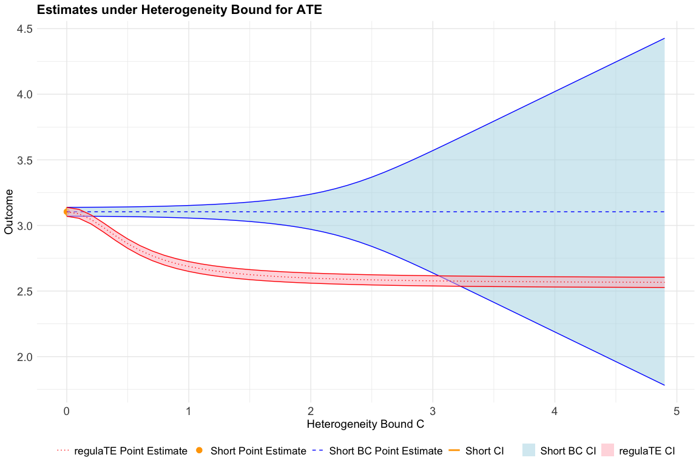

regulaTEr
================

<!-- badges: start -->

<!-- badges: end -->

**regulaTEr** implements the methods of Kwon and Sun (2025) to estimate
treatment effects under bounds on their heterogeneity.

## Installation

You can install the development version of **regulaTEr** from
[GitHub](https://github.com/) with:

``` r
# install.packages("pak")
# install.packages("devtools")
devtools::install_github("lsun20/regulaTEr")
```

## Functions

- `regulaTE()`: Calculates the regulaTE estimate and comparison
  estimators (short, bias-corrected short, and long) for the treatment
  effects under a specified bound on treatment effect heterogeneity.
- `plot_regulaTE()`: Plots the estimates from `regulaTE()` varying the
  bound on treatment effect heterogeneity.

## Example

The following is a basic example illustrating how **regulaTEr**
estimates ATE bounds under heterogeneity.

A small dataset is generated with four strata $X \in \{1,2,3,4\}$. Each
stratum has (i) a treatment probability, (ii) baseline outcomes $Y_0$,
and (iii) heterogeneous treatment effects $\tau(X)$. From this, we
simulate individual outcomes and run `regulaTE()`.

``` r
#library(regulaTEr)
devtools::load_all(".")
```

    ## ℹ Loading regulaTEr

``` r
rawdata <- data.frame(
  X = c(1, 2, 3, 4),
  probTreat = c(0.1, 0.5, 0.5, 0.9),
  probX = c(0.25, 0.25, 0.25, 0.25),
  Y0mean = c(0, 0, 0, 0),
  tauX = c(0, 5, 5, 0)
)

sigma <- 5
set.seed(1)
sim_size <- 500
simdata <- rawdata[sample(seq_len(nrow(rawdata)), size = sim_size, replace = TRUE, prob = rawdata$probX), ]
simdata$x <- as.integer(runif(sim_size) < simdata$probTreat)

Xvalues <- unique(simdata$X)
for (i in seq_along(Xvalues)) {
  dummy <- as.integer(simdata$X == Xvalues[i])
  if (sum(dummy) > 0) {
    simdata[[paste0("Z", i)]] <- dummy
  }
}
Z_uc <- as.matrix(simdata[, grep("^Z", names(simdata))])
Z_uc <- Z_uc[, -ncol(Z_uc)]  # drop last column to avoid collinearity

simdata$Y1mean <- simdata$Y0mean + simdata$tauX
C0 <- sd(simdata$tauX)
simdata$Y1 <- rnorm(sim_size, mean = simdata$Y1mean, sd = sigma)
simdata$Y0 <- rnorm(sim_size, mean = simdata$Y0mean, sd = sigma)
simdata$Y <- simdata$x * simdata$Y1 + (1 - simdata$x) * simdata$Y0

result <- regulaTE(
  outcome = simdata$Y,
  treatment = simdata$x,
  covariates = Z_uc,
  confounders = NULL,
  parameter = "ATE",
  C = C0,
  se = "hom",
  cluster = NULL,
  sig_level = 0.05,
  df_corr = TRUE,
  digits = 4,
  trimmed_data = NULL
)
```

    ## Parameter estimated: ATE 
    ## Sample size: 500 
    ## No. of covariates in short regression: 4 
    ## No. of covariates in long regression: 7 
    ## C (given by user): 2.494483 
    ## Lindeberg weights: 0.04480297 
    ## 
    ## Estimates:
    ##            ATE    Std Err  Critical Value    5% Conf Int     Max Bias 
    ## --------  ------  -------  --------------  ----------------  -------- 
    ## regulaTE  2.5853   0.6136          0.0633  [2.5465, 2.6242]    0.0814 
    ## Short     3.1043   0.5414          0.0627  [3.0703, 3.1382]    1.1267 
    ## Short BC  3.1043   0.5414          0.4843  [2.8421, 3.3665]    1.1267 
    ## Long      2.5593   0.6249          0.0627  [2.5201, 2.5985]         0

The output reports:

- The **regulaTE** estimate for the ATE under the specified
  heterogeneity bound $C$,
- The **short** estimate (with and without bias corrections),
- The **long** estimates
- Standard errors, confidence intervals, and maximum bias given $C$.

In addition to reporting point estimates at a single value of $C$,
**regulaTE** can trace how the estimated treatment effects and its
confidence set change as we vary the heterogeneity bound $C$. Below we
construct a grid of $C$ values and plot the estimates using
`plot_regulaTE()`.

``` r
C_ran <- seq(0, 2 * C0, 0.1)

result <- regulaTE(
  outcome = simdata$Y,
  treatment = simdata$x,
  covariates = Z_uc,
  confounders = NULL,
  parameter = "ATE",
  C = C_ran,
  se = "hom",
  cluster = NULL,
  sig_level = 0.05,
  df_corr = TRUE,
  digits = 4,
  trimmed_data = NULL
)
```

    ## Parameter estimated: ATE 
    ## Sample size: 500 
    ## No. of covariates in short regression: 4 
    ## No. of covariates in long regression: 7 
    ## C values used: 0, 0.1, 0.2, 0.3, 0.4, 0.5, 0.6, 0.7, 0.8, 0.9, 1, 1.1, 1.2, 1.3, 1.4, 1.5, 1.6, 1.7, 1.8, 1.9, 2, 2.1, 2.2, 2.3, 2.4, 2.5, 2.6, 2.7, 2.8, 2.9, 3, 3.1, 3.2, 3.3, 3.4, 3.5, 3.6, 3.7, 3.8, 3.9, 4, 4.1, 4.2, 4.3, 4.4, 4.5, 4.6, 4.7, 4.8, 4.9

``` r
plot_regulaTE(result$estimates, y_axis_title = "Outcome", title = NULL, show_long = FALSE)
```

<!-- -->
